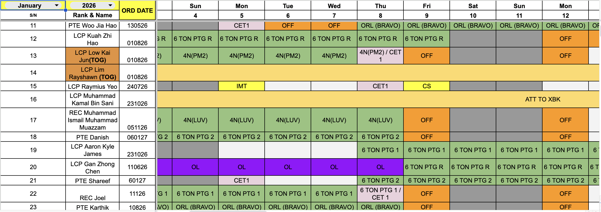
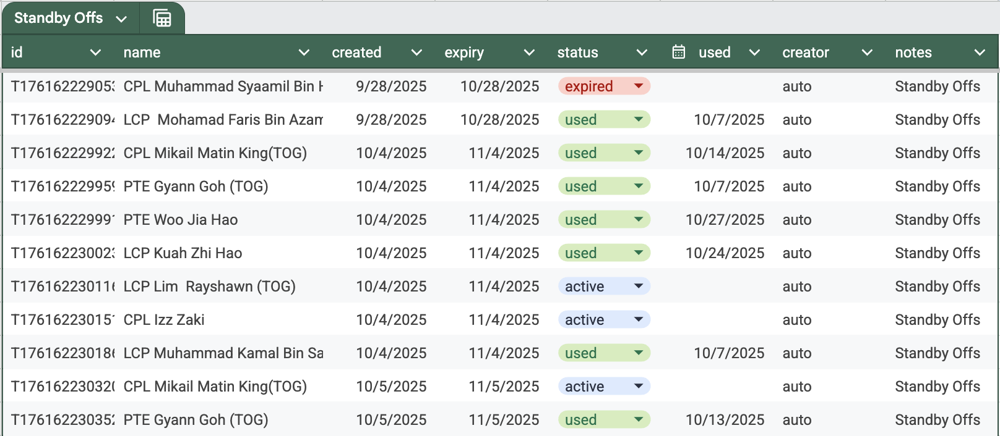
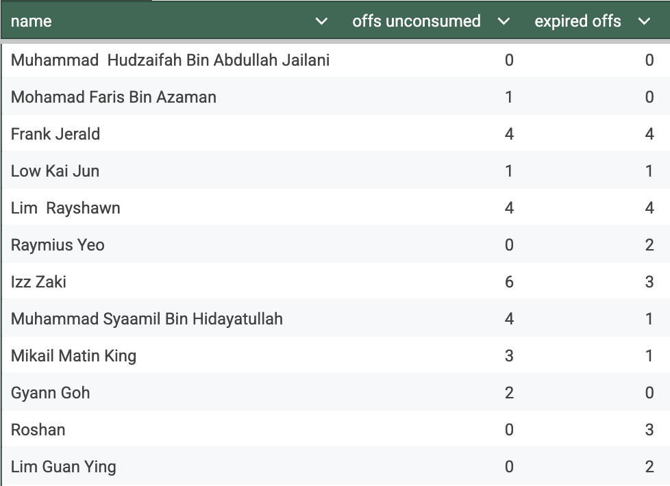
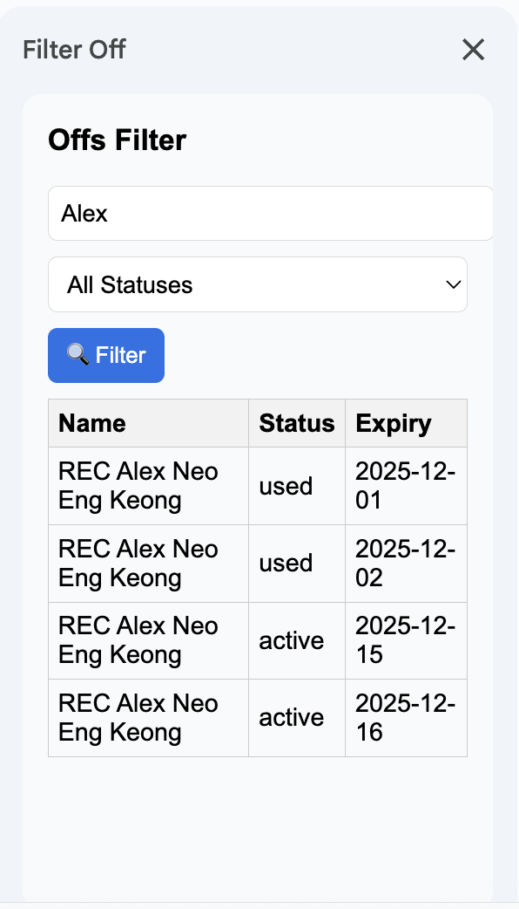
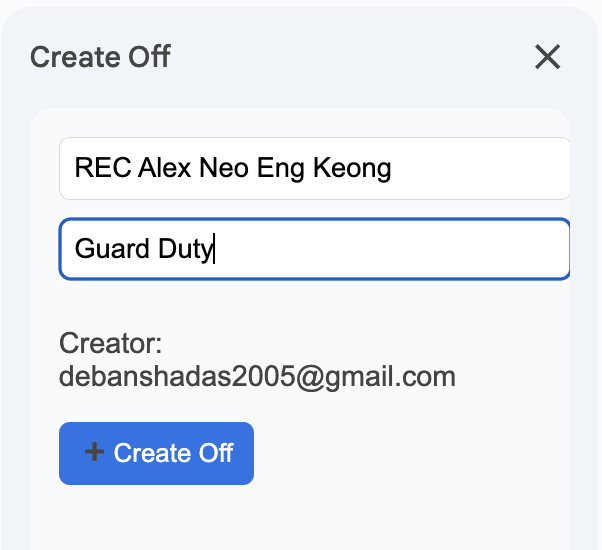
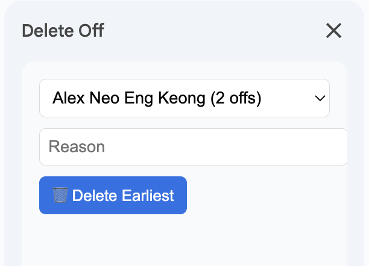

# NS Off Tracker

**Version:** 2.0 (291025)  
**Author:** 3SG Debansha  

A Google Apps Script automation tool for tracking duty offs and standby roles in spreadsheets.  
Automatically manages offs, expiry, and tracker updates, and allows manual off creation and deletion via sidebars.

---

## Table of Contents
- [Overview](#overview)
- [Features](#features)
- [Installation](#installation)
- [Usage](#usage)
- [Screenshots](#screenshots)
- [Contributing](#contributing)
- [License](#license)

---

## Overview
Off Tracker is designed to automate duty-off tracking for teams using Google Sheets.  
It reads a daily duty roster and:  
- Issues “offs” for standby duties on weekends  
- Tracks “off” entitlements and usage  
- Automatically expires and cleans up old/off tokens  
- Allows admins to add or remove manually offs when needed — all via custom sidebars   
This tool is especially suited for managing both weekday and weekend standby duties.

---

## Features
- **Daily automation:** Roster parsing & off-management via time-triggered `main()`
- **Manual UI:** Sidebar for *Create Off*, *Delete Off*, *Filter Offs*    
- **Expiry logic:** Auto-expiry and cleanup after one month  
- **Configurable standby roles:** Standby-role list maintained separately, easily updated  
- **Tracker sheet:** Shows current off balance per user  
- **Off Logs:** Tracks changes for transparency

---

## Installation
1. Open [Google Apps Script](https://script.google.com/) and create a new project.
2. Copy all `.gs` files and HTML files from this repository into the Apps Script project.
3. Replace the `DUTY_ROSTER_ID` and `OFFS_DB_ID` constants with your Google Sheet IDs.
4. Set up a **time-driven trigger**:
   - Function: `main`
   - Event: Time-driven → Day timer → 18:00 (or your preferred daily time)
5. Open the spreadsheet → see the **"Offs Manager"** menu to access the sidebars.

---

## Usage
- Use the **Offs Manager** custom menu to:
  - **Filter Offs**: View offs by user or status
  - **Create Off**: Add a new off for a user
  - **Delete Off**: Remove the earliest off for a user
- The **dailyRead** and **cleanUp** functions run automatically via the trigger to process daily updates.
- Trackers update automatically when offs are created, used, or expired.

---

## Screenshots
> Replace the placeholders with actual screenshots in `/screenshots` folder

*Sample Duty Roster for reference*

*Sample list of offs*

*Counter of how many offs an individual has*

  
*Filter offs by user or status*

  
*Create a new off for a user*

  
*Delete the earliest off for a user*

---

## Contributing
1. Fork the repository
2. Make your changes
3. Submit a pull request with a clear description of your changes

---

## License
MIT License  
See [LICENSE](LICENSE) for details.
